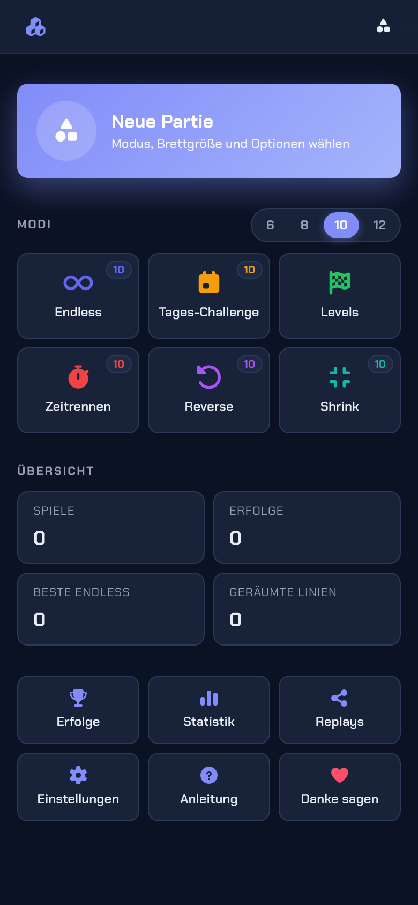
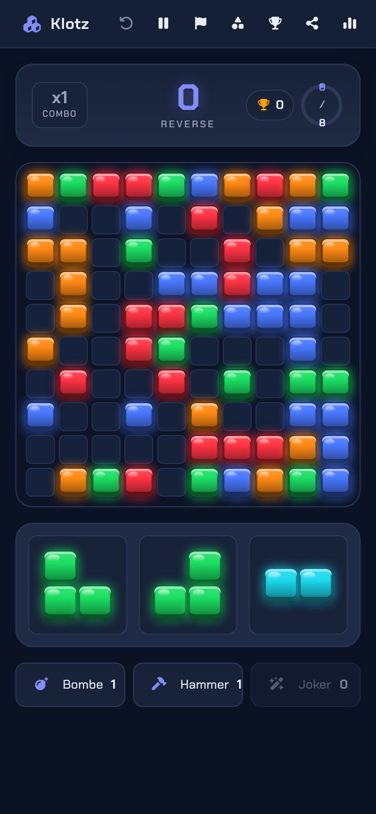
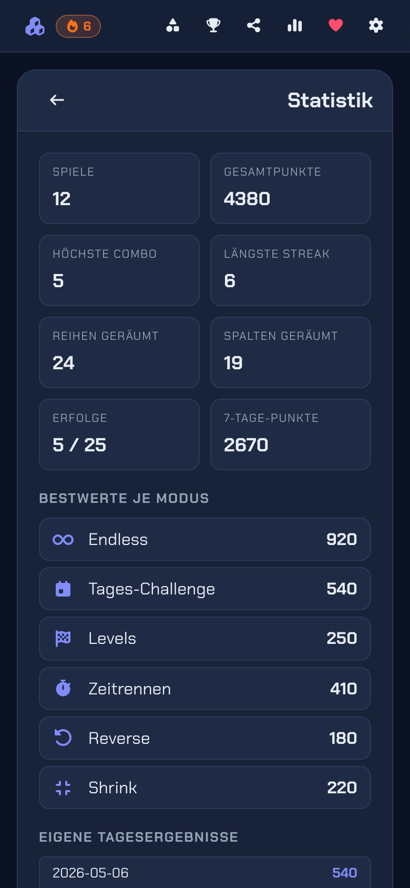

# Klotz

Block-Puzzle-Spiel im 1010!-Stil als Web-PWA. Lokal, offline, ohne Tracker.

**Direkt spielen:** <https://hallowelt42.github.io/Web-Game-Klotz/>

<p align="center">
  
  
  
</p>

## Spielprinzip

- Quadratisches Brett (6x6, 8x8, 10x10 oder 12x12), wählbar pro Modus
- Pro Runde drei Polyomino-Steine zur Auswahl, Refill nach drei gelegten Steinen
- Volle Reihen und Spalten lösen sich gleichzeitig auf
- Bei aufeinanderfolgenden Räumzügen baust du eine Combo auf -- ab Combo x2 verdienst du Specials
- Spielende, sobald keiner der verbleibenden Steine mehr passt

## Modi

- **Endless** -- klassisch, Solvability-Garantie schiebt nur platzierbare Pools
- **Tages-Challenge** -- pro Tag eine fest vorgegebene Steinfolge, dein Tagesergebnis im 30-Tage-Verlauf
- **Levels** -- 10 Stufen mit Hindernissen (Block + Eis), Punkt- und Zugzielen, 1-3 Sterne je nach Effizienz
- **Zeitrennen** -- 180 Sekunden, Combo zählt doppelt
- **Reverse** -- Brett startet voll, Ziel: 8 Linien räumen
- **Shrink** -- Brett schrumpft alle 12 Züge
- **Eigene Steinfolge** -- per Stichwort eine Steinfolge fixieren und mehrmals dieselbe Partie spielen

## Specials

- **Bombe** (3x3 leeren) -- ab Combo x3 oder alle ~60 geräumten Zellen
- **Hammer** (1 Zelle) -- ab Combo x5 oder alle ~130 geräumten Zellen
- **Joker** (1 freie Zelle besetzen) -- ab Combo x7 oder alle ~260 geräumten Zellen

Maximaler Special-Vorrat pro Sorte hängt von der Brettgröße ab: 2 bei 6x6, 3 bei 8x8 und 10x10, 4 bei 12x12 -- weitere Belohnungen verfallen, bis du eine eingesetzt hast. Reverse startet jeweils mit voll gefüllten Slots. Die Linien-Meilensteine sind ebenfalls brettgrößen-skaliert: auf 6x6 dauert es länger pro Linie als auf 12x12, sodass die Bonus-Frequenz unabhängig von der Brettgröße bleibt.

Specials werden über die Specials-Bar unter dem Pool ausgewählt und durch Klick auf eine Zelle eingesetzt.

## Steuerung

- **Drag & Drop** mit Maus oder Finger (Pointer Events, vereinheitlicht)
- **Tastatur**: Tab zwischen Pool-Slots, Pfeile zum Positionieren, Enter legt, Esc bricht ab
- **Geister-Vorschau** beim Hover, Linien-Hint hebt zu räumende Reihen/Spalten hervor

## Routing (ohne Hash)

- `/`, `/endless`, `/daily`, `/timed`, `/reverse`, `/shrink`
- `/endless/6` etc. für optionale Brettgröße
- `/levels`, `/levels/level-3` direkt ins Level
- `/seed/<stichwort>` für eine eigene fixierte Steinfolge
- `/replay/<mode>/<seed>/<moves>` -- Klotz speichert deine Partien lokal und kann sie über die URL eindeutig rekonstruieren
- `/stats`, `/achievements`, `/replays`, `/settings`, `/help`, `/danke`

## Stack

- Vite + Svelte 5 (Runes, ohne SvelteKit) + TypeScript strict
- IndexedDB via `idb-keyval` für Spielstand, Highscores, Stats, Einstellungen
- Web-Audio für Sound, `navigator.vibrate` für Haptik
- `vite-plugin-pwa` für Manifest + Service-Worker (offline-fähig)
- Chakra Petch + Font Awesome lokal gebündelt

## Entwicklung

```bash
pnpm install
pnpm dev       # Dev-Server auf 5181
pnpm test      # Vitest (board, score, engine)
pnpm check     # svelte-check + tsc
pnpm build     # Production-Build inkl. Service-Worker
```

Der Build erzeugt `dist/`. Auf GitHub Pages wird der Build mit `KLOTZ_BASE=/Web-Game-Klotz/` deployt -- siehe `.github/workflows/deploy.yml`.

## Persistenz

Alles bleibt lokal in IndexedDB des Geräts:

- Aktuelle Endless-Partie + Resume-Prompt
- Highscore pro Modus
- Lifetime-Statistik (Spiele, Combos, Linien, Heatmap)
- Achievements-Fortschritt (24 Erfolge in Bronze/Silber/Gold)
- Letzte 25 Replays mit Seed + Zugfolge
- Einstellungen (Theme, Palette, Sound, Haptik, Brettgröße)

Daten löschen über Einstellungen > Alle Daten löschen.

## Datenschutz

Reines Single-Player-Spiel. Keine externen Requests, keine Telemetrie, keine Werbung, kein Backend, kein Account, keine Vergleiche mit anderen -- nur du gegen deine eigene Bestleistung.

## Lizenz

**Nicht-kommerzielle Nutzung** -- Siehe [LICENSE](LICENSE)

Erlaubt: Private Nutzung, Installation, persönliche Anpassungen, Teilen mit Quellenangabe

Verboten: Kommerzielle Nutzung, Verkauf, Einbindung in kommerzielle Produkte

---

## Unterstützen

Klotz ist ein privates Hobby-Projekt. Kein Tracking, keine Werbung, keine Kompromisse.

Wenn dir das Spiel gefällt, kannst du im Spiel über das Herz-Icon "Danke sagen" -- oder direkt hier:

[](https://ko-fi.com/HalloWelt42)

**Crypto:**

| Coin | Adresse |
|------|---------|
| BTC | `bc1qnd599khdkv3v3npmj9ufxzf6h4fzanny2acwqr` |
| DOGE | `DL7tuiYCqm3xQjMDXChdxeQxqUGMACn1ZV` |
| ETH | `0x8A28fc47bFFFA03C8f685fa0836E2dBe1CA14F27` |

Copyright (c) 2025-2026 HalloWelt42
